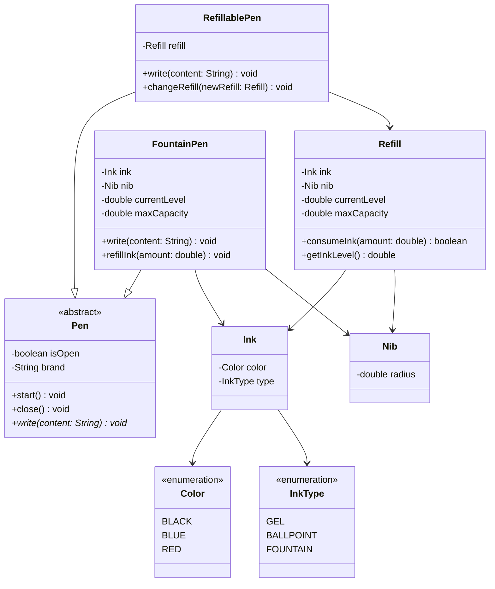

```mermaid
classDiagram
    class Color {
        <<enumeration>>
        BLACK
        BLUE
        RED
    }

    class InkType {
        <<enumeration>>
        GEL
        BALLPOINT
        FOUNTAIN
    }

    class Ink {
        -Color color
        -InkType type
    }

    class Nib {
        -double radius
    }

    class Refill {
        -Ink ink
        -Nib nib
        -double currentLevel
        -double maxCapacity
        +consumeInk(amount: double) boolean
        +getInkLevel() double
    }

    class Pen {
        <<abstract>>
        -boolean isOpen
        -String brand
        +start() void
        +close() void
        +write(content: String) void*
    }

    class RefillablePen {
        -Refill refill
        +write(content: String) void
        +changeRefill(newRefill: Refill) void
    }

    class FountainPen {
        -Ink ink
        -Nib nib
        -double currentLevel
        -double maxCapacity
        +write(content: String) void
        +refillInk(amount: double) void
    }

    Ink --> Color
    Ink --> InkType
    Refill --> Ink
    Refill --> Nib
    RefillablePen --|> Pen
    FountainPen --|> Pen
    RefillablePen --> Refill
    FountainPen --> Ink
    FountainPen --> Nib
```
